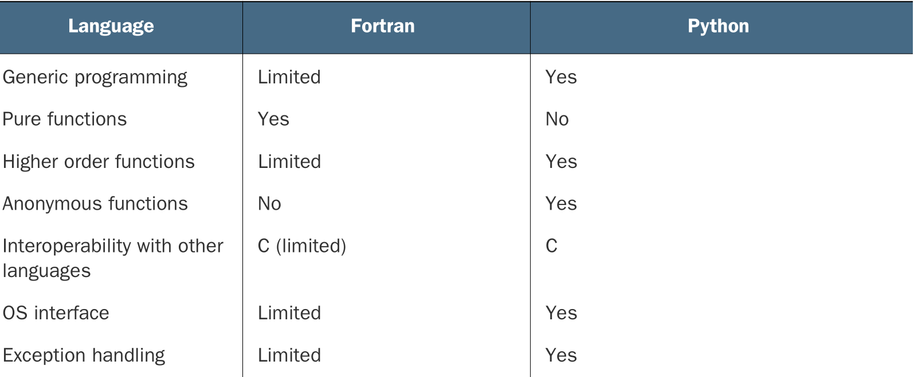
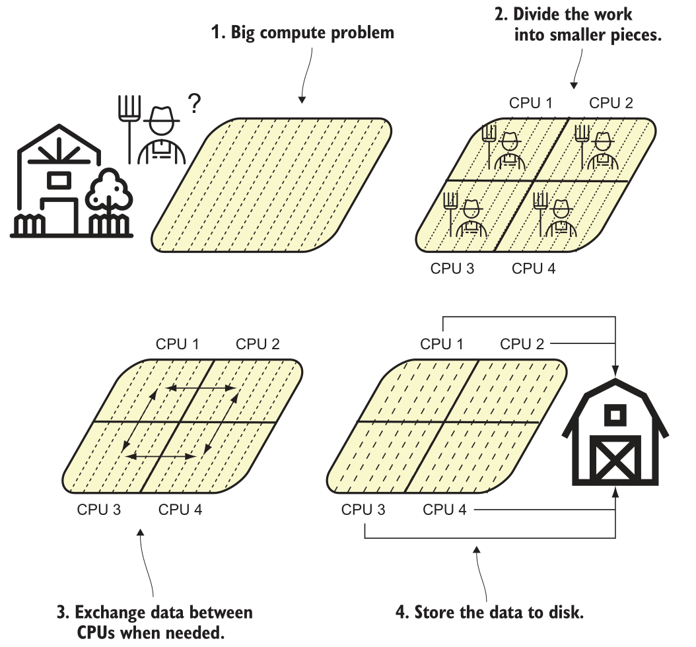
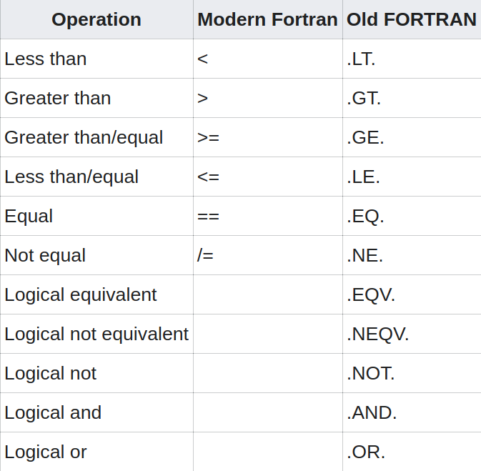

---
title:
- Curso de Fortran
subtitle:
- básico ao intermediário
author:
- Átila Saraiva Quintela Soares
---

# Historia do Fortran

Desenvolvido pela IBM em 1950 para aplicações para a ciência e engenharia.

{width=5cm}

# Historia do Fortran

A galera naquela época escrevia o código de máquina na mão. O FORTRAN revolucionou propondo uma linguagem de alto nível.


# Historia do Fortran


# Historia do Fortran

O Fortran teve algumas revisões:

## Revisões não padronizadas

+ FORTRAN
+ FORTRAN II (1958)
+ FORTRAN III (1958, não liberada)
+ IBM 1401 FORTRAN (1959)
+ FORTRAN IV (1962)

# Historia do Fortran

O Fortran teve algumas revisões:

## Revisões padronizadas (ANSI)

+ FORTRAN 66
+ FORTRAN 77
+ Fortran 90
+ Fortran 95
+ Fortran 2003
+ Fortran 2008
+ Fortran 2018

# Historia do Fortran

Hoje Fortran é utilizado sorrateiramente em diversas aplicações ainda hoje:

+ Predição numérica de clima, oceano, e surfe
+ Predição e ciência do clima
+ Software de dinâmica de fluido, usado em engenharia mecânica e civil
+ Solucionadores de aerodinâmica para projetar carros, aviões, e espaçonaves
+ Bibliotecas de algebra linear rápidas usadas por bibliotecas de aprendizado de máquina
+ Fazer benchmark dos supercomputadores mais rápidos do mundo

Milan Curcic; Modern Fortran - Building Efficient Parallel Applications

# Características do Fortran

+ Compilada
+ Tipagem estática
+ Multiparadigma
+ Paralel
+ Madura
+ Fácil de aprender

# Porque aprender Fortran?

## Orientada para arrays

```fortran
do j = 1, jm
    do i = 1, im
        c(i,j) = a(i,j) * b(i,j)
    end do
end do
```
pode ser expresso como:

```
c = a * b
```

# Porque aprender Fortran?

+ A única linguagem paralela desenvolvida por um comitê normativo (ISO)
+ Bibliotecas maduras para ciência, engenharia e matemática
+ Ecosistema para programação "general-purpuse" em crescimento
+ Performance imbatível

# Vantagens e desvantagens

Muitas das características do Fortran são tanto uma vantagem quanto uma desvantagem, por exemplo:

+ É uma linguagem específica de domínio (DSL)
+ Linguagem nichada
+ Linguagem fortemente e estaticamente tipada

# Comparação com Python


# Comparação com Python



# Comparação com Python

[Python x Octave x Fortran](https://www.youtube.com/watch?v=pJIxVS-wlHc)

# Fortran em paralelo, exemplo

{height=8cm}


# Preparando ambiente de desenvolvimento

Para garantir que vamos trabalhar com a mesma versão dos programas, preparei um ambiente para a gente, siga os comandos abaixo
```shell
git clone https://github.com/AtilaSaraiva/Curso-fortran-2022
cd Curso-fortran-2022/codigos
sh prep.sh
```

# Hello world

Agora vamos escrever um código de hello world

## Abrindo arquivo
```
cd 1-helloworld
notepadqq oi.f90 &
```

## Código

```fortran
program hellou
    implicit none

    print*, "E ai galera"
end program hellou
```

## Compilar e executar

```
gfortran oi.f90 -o oi
./oi
```

# Estrutura básica de um programa

```fortran08
program main
    implicit none
    integer :: a

    a = increment(34)
    write (*,*) a

contains

    function increment(input) result (output)
        integer :: output
        integer :: input

        output = input + 1
    end function increment

end program main
```

# Comentário

```fortran
a = b ! Isso é um comentario

c = d ! Isso!! também é um comentário
```

# Variáveis

```fortran
real             :: numeroDecimal = 3.141592
integer          :: numeroInteiro = 3
character        :: caractere     = "a"
character(len=5) :: nome          = "atila"
logical          :: boleano       = .true.

print*, "Número real: ", numeroDecimal
print*, "Número inteiro: ", numeroInteiro
print*, "Caractere único: ", caractere
print*, "String: ", nome
print*, "Boleano: ", boleano
```

# Números complexos

```fortran
program numerosComplexos
    implicit none
    complex, parameter :: i = (0, 1)   ! sqrt(-1)
    complex :: x, y, z
    x = (7, 8)
    y = (5, -7)
    write(*,*) i * x * y
    z = x + y
    print *, "z = x + y = ", z
    z = x - y
    print *, "z = x - y = ", z
    z = x * y
    print *, "z = x * y = ", z
    z = x / y
    print *, "z = x / y = ", z
end program numerosComplexos
```

# Funções instrísecas

```fortran
x = sin(3.14159)
y = exp(0)
z = log(1)
w = acos(-1)
```

# I/O Básico

## Para ler variável do terminal

```fortran
read(*,*) variavel
```

## Para imprimir o valor de uma variável na tela

```fortran
print*, variavel
```

ou

```fortran
write(*,*) variavel
```

## Exercício

Escrever código que lê dois números reais do terminal e imprime o resultado da soma deles

# Loops

Dois tipos básicos

```fortran
print*, "do simples"
do i=1,3
    do j=1,3
        print*, i,j
    end do
end do

print*, "do while"
i=1
do while(i<=3)
    j = 1
    do while(j<=3)
        print*, i,j
        j = j + 1
    end do
    i = i + 1
end do
```

# Loops

## Do concurrent

```fortran
print*, "do concurrent"
do concurrent(i=1:3, j=1:3)
    print*, i,j
end do
```

## Exercício

Escreva o código dos últimos dois slides e veja o resultado

# Condicionais

```fortran
if (logical_expression1) then
   ! Block of code
else if (logical_expression2) then
   ! Block of code
else
   ! Block of code
end if
```

# Condicionais

{height=7cm}

# Condicionais

## Para checar mais de uma expressão faça

```
if ((a .gt. b) .and. .not. (a .lt. c)) then
```

# Condicionais

```fortran
program xif
    implicit none
    real :: x
    real, parameter :: x1 = 0.3, x2 = 0.6

    call random_seed()
    call random_number(x)
    if (x < x1) then
        print *, x, "<",x1
    else if (x < x2) then
        print *, x, "<", x2
    else
        print *, x, ">=", x2
    end if
end program xif
```

# Case

Nós podemos representar o seguinte código

```fortran
if (month=="January" .or. month=="December") then
    num_days = 31
else if (month=="February") then
    num_days = 28
else if (month=="March") then
    num_days = 31
else
    num_days = 30
end if
```

# Case

De forma simplificada por

```fortran
select case (month)
    case ("January", "December")
        num_days = 31
    case ("February")
        num_days = 28
    case ("March")
        num_days = 31
    case default
        num_days = 30
end select
```

## Exercício

Escreva um programa que pegue um inteiro do terminal e para os casos 1 até 4 imprima "Isso é um", "Isso é dois"... para cada caso, e pro caso default imprima "Não está entre 1 e 4"

# Funções e Subrotinas

::: columns

:::: {.column width=60%}
```fortran
function sum(a, b)
    integer, intent(in) :: a, b
    integer             :: sum

    sum = a + b

end function sum

subroutine add(a, b)
    integer, intent(in out) :: a
    integer, intent(in)     :: b

    a = a + b
    print*, 'a = ',a
end subroutine add
```
::::


:::: {.column width=40%}
```
total = 2 * sum(3,5)

call add(a,3)
```
::::

:::

# O que devo usar

{height=8cm}

# Exercício

Abra o código da pasta 7-funcao e passe todas as operações destacadas para dentro de funções ou subrotinas de acordo

# Modules

```fortran
module biblioteca
    implicit none
contains
    pure integer function add (a,b)
        integer, intent(in):: a, b
    end function add
end module biblioteca

program main
    use biblioteca
    implicit none
    integer:: a=1, b=2

    print*, add(a,b)

end program main
```

# Exercício

Copie a pasta 7-funcao para 8-module e mude as funções e subrotinas escritas para dentro de um módulo.

# Array

## Como declarar um array 1D, 2D, ... ND?
```fortran
real :: array(2)     ! array 2
real :: array(2,2)   ! array 2x2
real :: array(2,2,2) ! array 2x2x2
```

## Como inserir um valor num array
```fortran
array(1,1) = 1
```

## Como inserir um valor para todos os items do array
```fortran
array = 1
```

## Como inicializar vários valores
```fortran
array = [ 1, 2, 3, 4 ]
```

# Array

## Como passar array para função

```fortran
subroutine foo (a, b, c, d, n)
    integer :: n
    real    :: a(n)    ! declaração explicita
    real    :: b(:)    ! forma assumida
    real    :: c(:,:)  ! forma assumida 2D
    real    :: d(..)   ! dimensão assumida

    ...
end subroutine foo
```

# Array

## Como descobrir as dimensões de um array

```fortran
tamanho = size(a)
```
ou
```fortran
integer :: m, n
real    :: array(:,:)

m = size(array, 1)
n = size(array, 2)
```

# Exercício

Vá na pasta 9-array e escreva o loop do dot product no espaço comentado

# Funções intrísecas para array

```
matmul()
dot_product()
transpose()
```

# Arrays alocáveis

```fortran
program foo
    implicit none
    real,allocatable :: a(:)

    allocate( a(10) )

    a = [ 1, 2, 3, 4, 5, 6, 7, 8, 9, 10 ]

    deallocate(a)
end program foo
```

# Arrays alocáveis

```fortran
program foo
    implicit none
    real,allocatable :: a(:)

    a = [ 1, 2, 3, 4, 5, 6, 7, 8, 9, 10 ]
end program foo
```

# Fazendo fatiamento de array

```fortran
program foo
    implicit none
    real,allocatable :: a(:)

    a = [ (i, i=1,10) ]

    print*, a
    print*, a(:4)
    print*, a(2:5)
end program foo
```

## Exercício:

Ir na pasta 9-array e reproduzir o código desse slide

# I/O de arquivo

O comando base para manipulação de arquivo é:

```fortran
integer :: io
open(newunit=io, file="log.txt")
! ...
close(io)
```

# I/O de arquivo

Para criar uma acesso read-only ao arquivo, as opções `status` e `action` tem que ser especificadas

```fortran
integer :: io
open(newunit=io, file="log.txt", &
    status="old", action="read")
read(io, *) a, b
close(io)
```

Você também pode checar se um arquivo existe antes de fazer algo:

```fortran
logical :: exists
inquire(file="log.txt", exist=exists)
if (exists) then
  ! ...
end if
```

# I/O de arquivo

```fortran
program aprendendoIO
    implicit none
    integer :: io
    real,allocatable :: v(:,:)

    allocate(v(2,2))
    v(1,:) = [ 1, 2 ]
    v(2,:) = [ 3, 4 ]

    open(newunit=io, file="log.txt", &
      & status="replace", action="write")
    write(io, *) v(:,:)
    close(io)
end program aprendendoIO
```

## Exercicio:

Reproduzir código do slide na pasta 10-io_arquivo

# I/O de arquivo

Tem várias opções para o `open`, as principais são

+ **`newunit=nu`** unidade identificadora do arquivo, integer
+ **`file=fln`** string contendo nome do arquivo
+ **`status=stn`,** onde `stn="old"`,`"new"`, ou `"replace"`
+ **`action=act`,** onde `act="write"`, `"read"`, ou `"readwrite"`
+ **`iostat=ios`** variável de controle de erro, `ios/=0` para erros, integer

## Mais avançadas

+ **`access=acl`,** onde `acl="sequential"`, `"direct"`, `"stream"`,
+ **`recl=rcl`**  string que indica o tamanho de cada gravação, ou record do arquivo binário aberto com `access=direct`
+ **`form=frm`**, onde `frm="formatted" ou `"unformatted"`


# I/O de arquivo binário - acesso direto

Para ler arquivos binários geralmente se usa acesso direto

Para escrever
```fortran
inquire(iolength=length) v
open(newunit=io, file="binary", access="direct",&
    recl=length, status="replace", action="write")
write(io, rec=1) v
```

Para ler
```fortran
inquire(iolength=length) v
open(newunit=io, file="binary", access="direct",&
    recl=length, status="old", action="read")
read(io, rec=1) v
```

## Exercício:

Cria um array, escreve ele em um arquivo binário, depois lê o arquivo e imprime o array na tela

# I/O de arquivo binário - acesso stream

Pode ser também usado o stream access

Para escrever
```fortran
open(newunit=io, file="binary", access="stream",&
    status="replace", action="write")
write(io, rec=1) v
```

Para ler
```fortran
inquire(iolength=length) v
open(newunit=io, file="binary", access="stream",&
    status="old", action="read")
read(io, rec=1) v
```

## Exercício:

Cria um array, escreve ele em um arquivo binário, depois lê o arquivo e imprime o array na tela


# Pausa para aprender sobre fpm e pyplot-fortran

Estudar código na pasta 13-pyplotfortran


# Lendo um campo de velocidade - Marmousi 2D

Vá para a pasta 14-io_binario_plot/marmousi_plot/app e edite o arquivo main.f90 para ler um arquivo binário `model-375.cwp`.

# Projeto Filtro Laplaciano

Vamos escrever o código de um filtro laplaciano aplicado ao campo de velocidade Marmousi 2D.

# Argumentos opicionais para funções

```fortran
program main
    print *, "[no args] tester()   :", tester()
    print *, "[   args] tester(1.0):", tester(1.0)

contains

    real function tester(a)
        real, intent (in), optional :: a
        if (present(a)) then
            tester = a
        else
            tester = 0.0
        end if
    end function
end program
```

# Atributo `save` - salvando variáveis entre calls

```fortran
program main
    implicit none

    call f()  ! yields: 1
    call f()  ! yields: 2
    call f()  ! yields: 3

contains

    subroutine f()
        implicit none
        integer, save :: i = 0

        i = i + 1
        print *, "value i:", i
    end subroutine f
end program main
```

# Sobrecarregamento de funções - o problema

O objetivo é poder chamar uma função add(x, y) que funcione tanto para `integer` quanto para `character`.

```fortran
pure function add_int( x, y )
    integer, intent (in) :: x, y
    integer :: add_int

    add_int = x+y
end function add_int

pure function add_char( x, y )
    character (len=*), intent (in) :: x, y
    character (len=len(x)+len(y)), allocatable :: add_char

    add_char = x // y
end function add_char
```

# Sobrecarregamento de funções - a solução

```fortran
module add_mod
    implicit none
    private
    public :: add

    interface add
        procedure add_int, add_char
    end interface add

contains
    pure function add_int( x, y )
        integer, intent (in) :: x, y
        integer :: add_int

        add_int = x+y
    end function add_int

    pure function add_char( x, y )
        character (len=*), intent (in) :: x, y
        character (len=len(x)+len(y)), allocatable :: add_char

        add_char = x // y
    end function add_char
end module add_mod
```
