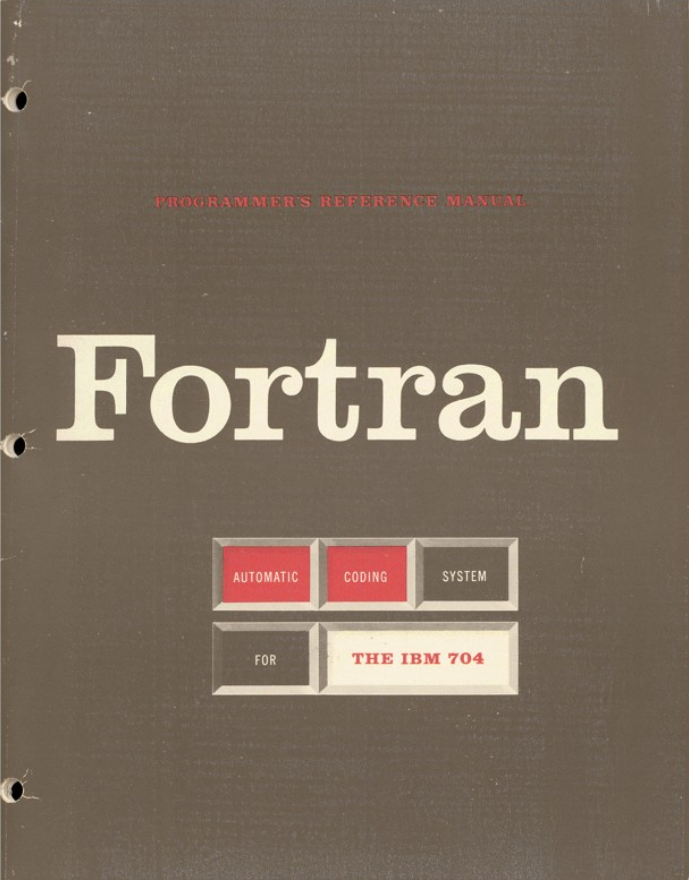
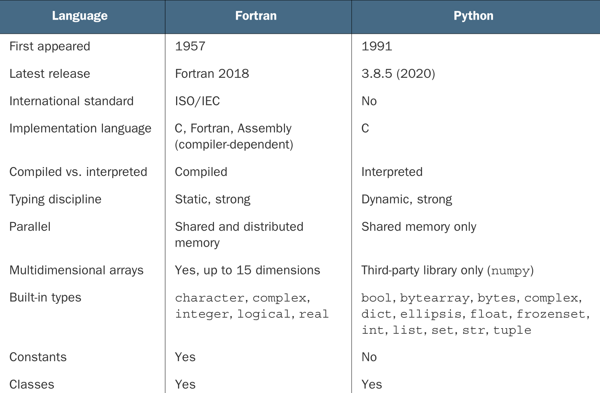

---
title:
- Curso de Fortran
subtitle:
- básico ao intermediário
author:
- Átila Saraiva Quintela Soares
---

# Historia do Fortran

Desenvolvido pela IBM em 1950 para aplicações para a ciência e engenharia.

{width=5cm}

# Historia do Fortran

A galera naquela época escrevia o código de máquina na mão. O FORTRAN revolucionou propondo uma linguagem de alto nível.


# Historia do Fortran


# Historia do Fortran

O Fortran teve algumas revisões:

## Revisões não padronizadas

+ FORTRAN
+ FORTRAN II (1958)
+ FORTRAN III (1958, não liberada)
+ IBM 1401 FORTRAN (1959)
+ FORTRAN IV (1962)

# Historia do Fortran

O Fortran teve algumas revisões:

## Revisões padronizadas (ANSI)

+ FORTRAN 66
+ FORTRAN 77
+ Fortran 90
+ Fortran 95
+ Fortran 2003
+ Fortran 2008
+ Fortran 2018

# Historia do Fortran

Hoje Fortran é utilizado sorrateiramente em diversas aplicações ainda hoje:

+ Predição numérica de clima, oceano, e surfe
+ Predição e ciência do clima
+ Software de dinâmica de fluido, usado em engenharia mecânica e civil
+ Solucionadores de aerodinâmica para projetar carros, aviões, e espaçonaves
+ Bibliotecas de algebra linear rápidas usadas por bibliotecas de aprendizado de máquina
+ Fazer benchmark dos supercomputadores mais rápidos do mundo

Milan Curcic; Modern Fortran - Building Efficient Parallel Applications

# Características do Fortran

+ Compilada
+ Tipagem estática
+ Multiparadigma
+ Paralel
+ Madura
+ Fácil de aprender

# Porque aprender Fortran?

## Orientada para arrays

```fortran
do j = 1, jm
    do i = 1, im
        c(i,j) = a(i,j) * b(i,j)
    end do
end do
```
pode ser expresso como:

```
c = a * b
```

# Porque aprender Fortran?

+ A única linguagem paralela desenvolvida por um comitê normativo (ISO)
+ Bibliotecas maduras para ciência, engenharia e matemática
+ Ecosistema para programação "general-purpuse" em crescimento
+ Performance imbatível

# Vantagens e desvantagens

Muitas das características do Fortran são tanto uma vantagem quanto uma desvantagem, por exemplo:

+ É uma linguagem específica de domínio (DSL)
+ Linguagem nichada
+ Linguagem fortemente e estaticamente tipada

# Comparação com Python



# Comparação com Python


# Comparação com Python

[Python x Octave x Fortran](https://www.youtube.com/watch?v=pJIxVS-wlHc)

# Fortran em paralelo, exemplo

{height=8cm}


# Preparando ambiente de desenvolvimento

Para garantir que vamos trabalhar com a mesma versão dos programas, preparei um ambiente para a gente, siga os comandos abaixo
```shell
git clone https://github.com/AtilaSaraiva/Curso-fortran-2022
cd Curso-fortran-2022/codigos
sh prep.sh
```

# Hello world

Agora vamos escrever um código de hello world

## Abrindo arquivo
```
cd 1-helloworld
notepadqq oi.f90 &
```

## Código

```fortran
program hellou
    implicit none

    print*, "E ai galera"
end program hellou
```

## Compilar e executar

```
gfortran oi.f90 -o oi
./oi
```

# Estrutura básica de um programa

```fortran08
program main
    implicit none
    integer :: a

    a = increment(34)
    write (*,*) a

contains

    function increment(input) result (output)
        integer :: output
        integer :: input

        output = input + 1
    end function increment

end program main
```

# Comentário

```fortran
a = b ! Isso é um comentario

c = d ! Isso!! também é um comentário
```

# Variáveis

```fortran
real             :: numeroDecimal = 3.141592
integer          :: numeroInteiro = 3
character        :: caractere     = "a"
character(len=5) :: nome          = "atila"

print*, "Número real: ", numeroDecimal
print*, "Número inteiro: ", numeroInteiro
print*, "Caractere único: ", caractere
print*, "String: ", nome
```

# Números complexos

```fortran
program numerosComplexos
    implicit none
    complex, parameter :: i = (0, 1)   ! sqrt(-1)
    complex :: x, y, z
    x = (7, 8)
    y = (5, -7)
    write(*,*) i * x * y
    z = x + y
    print *, "z = x + y = ", z
    z = x - y
    print *, "z = x - y = ", z
    z = x * y
    print *, "z = x * y = ", z
    z = x / y
    print *, "z = x / y = ", z
end program numerosComplexos
```

# Funções instrísecas

```fortran
x = sin(3.14159)
y = exp(0)
z = log(1)
w = acos(-1)
```

# I/O Básico

## Para ler variável do terminal

```fortran
read(*,*) variavel
```

## Para imprimir o valor de uma variável na tela

```fortran
print*, variavel
```

ou

```fortran
write(*,*) variavel
```

## Exercício

Escrever código que lê dois números reais do terminal e imprime o resultado da soma deles

# Loops

Dois tipos básicos

```fortran
print*, "do simples"
do i=1,3
    do j=1,3
        print*, i,j
    end do
end do

print*, "do while"
i=1
do while(i<=3)
    j = 1
    do while(j<=3)
        print*, i,j
        j = j + 1
    end do
    i = i + 1
end do
```

# Loops

## Do concurrent

```fortran
print*, "do concurrent"
do concurrent(i=1:3, j=1:3)
    print*, i,j
end do
```

## Exercício

Escreva o código dos últimos dois slides e veja o resultado
