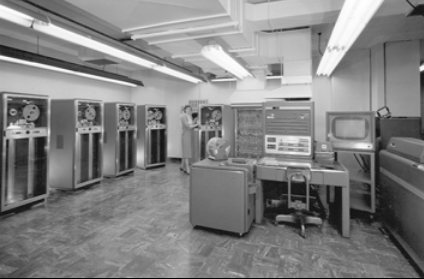

---
title:
- Curso de Fortran
subtitle:
- básico ao intermediário
author:
- Átila Saraiva Quintela Soares
---

# Historia do Fortran

Desenvolvido pela IBM em 1950 para aplicações para a ciência e engenharia.

{width=5cm}

# Historia do Fortran

A galera naquela época escrevia o código de máquina na mão. O FORTRAN revolucionou propondo uma linguagem de alto nível.


# Historia do Fortran



# Historia do Fortran

O Fortran teve algumas revisões:

## Revisões não padronizadas

+ FORTRAN
+ FORTRAN II (1958)
+ FORTRAN III (1958, não liberada)
+ IBM 1401 FORTRAN (1959)
+ FORTRAN IV (1962)

# Historia do Fortran

O Fortran teve algumas revisões:

## Revisões padronizadas (ANSI)

+ FORTRAN 66
+ FORTRAN 77
+ Fortran 90
+ Fortran 95
+ Fortran 2003
+ Fortran 2008
+ Fortran 2018

# Historia do Fortran

Hoje Fortran é utilizado sorrateiramente em diversas aplicações ainda hoje:

+ Predição numérica de clima, oceano, e surfe
+ Predição e ciência do clima
+ Software de dinâmica de fluido, usado em engenharia mecânica e civil
+ Solucionadores de aerodinâmica para projetar carros, aviões, e espaçonaves
+ Bibliotecas de algebra linear rápidas usadas por bibliotecas de aprendizado de máquina
+ Fazer benchmark dos supercomputadores mais rápidos do mundo

Milan Curcic; Modern Fortran - Building Efficient Parallel Applications

# Características do Fortran

+ Compilada
+ Tipagem estática
+ Multiparadigma
+ Paralel
+ Madura
+ Fácil de aprender

# Porque aprender Fortran?

## Orientada para arrays

```fortran
do j = 1, jm
    do i = 1, im
        c(i,j) = a(i,j) * b(i,j)
    end do
end do
```
pode ser expresso como:

```
c = a * b
```

# Porque aprender Fortran?

+ A única linguagem paralela desenvolvida por um comitê normativo (ISO)
+ Bibliotecas maduras para ciência, engenharia e matemática
+ Ecosistema para programação "general-purpuse" em crescimento
+ Performance imbatível

# Vantagens e desvantagens

Muitas das características do Fortran são tanto uma vantagem quanto uma desvantagem, por exemplo:

+ É uma linguagem específica de domínio (DSL)
+ Linguagem nichada
+ Linguagem fortemente e estaticamente tipada

# Comparação com Python


# Comparação com Python


# Fortran em paralelo, exemplo

{height=8cm}


# Hello world

Agora vamos escrever um código de hello world
